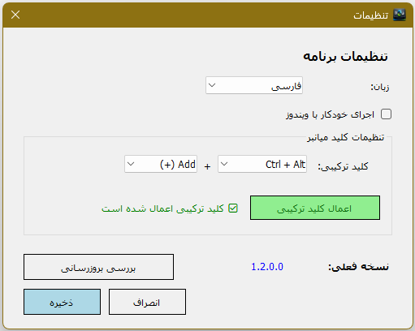

# ⌨️ Wrong Keyboard Fixer

**فارسی** | [📖 English](README.md)

یک ابزار سبک و کاربردی برای ویندوز که مشکل تایپ فارسی/انگلیسی با کیبوردهای اشتباه را به سرعت حل می‌کند.

---

## 📝 توضیحات

گاهی اوقات هنگام تایپ، متوجه می‌شوید که کیبورد شما در حالت اشتباه (فارسی به جای انگلیسی یا برعکس) قرار دارد و متنی که تایپ می‌کنید نامفهوم می‌شود. این برنامه با استفاده از یک **کلید ترکیبی**، متن انتخاب‌شده را تشخیص داده و به زبان صحیح تبدیل می‌کند.

---

## ✨ قابلیت‌ها

- ✅ **تبدیل خودکار متن** بین فارسی و انگلیسی
- ✅ **کلید ترکیبی قابل تنظیم** (پیش‌فرض: `Ctrl + Alt + Add(+)`)
- ✅ **اجرای خودکار با ویندوز** (اختیاری)
- ✅ **نمایش در سینی سیستم** (کنار ساعت)
- ✅ **رابط کاربری دوزبانه** — فارسی (راست‌چین) و انگلیسی
- ✅ **تنظیمات قابل ذخیره** در فایل JSON
- ✅ **جلوگیری از اجرای چند نمونه** از برنامه
- ✅ **ساخته‌شده با دات‌نت 10 و Native AOT** — بدون نیاز به Runtime

---

## 📸 تصاویر

### پنجره تنظیمات


---

## 🚀 نحوه استفاده

### نصب و اجرا

1. فایل اجرایی (`WrongKeyboardFixer.exe`) را اجرا کنید.
2. برنامه در **سینی سیستم** (کنار ساعت) قرار می‌گیرد.
3. روی آیکون برنامه راست‌کلیک کنید و **تنظیمات** را انتخاب کنید.

### نحوه کار

1. متنی که اشتباه تایپ شده را **انتخاب** کنید (هایلایت کنید).
2. کلید ترکیبی را فشار دهید (`Ctrl + Alt + Add(+)` به طور پیش‌فرض).
3. متن به طور خودکار به زبان صحیح تبدیل و جایگزین می‌شود.

---

## ⚙️ تنظیمات

| تنظیم | توضیح |
|-------|-------|
| **زبان** | انتخاب زبان رابط کاربری: فارسی یا English |
| **اجرای خودکار با ویندوز** | اجرای خودکار برنامه هنگام شروع ویندوز |
| **کلید ترکیبی** | تنظیم کلید میانبر دلخواه |

### کلیدهای ترکیبی قابل انتخاب

| کلید اصلاح‌کننده (Modifier) | کلید اصلی |
|------------------------------|-----------|
| `Ctrl + Alt` | `Add (+)`, `Subtract (-)`, `Multiply (*)` |
| `Ctrl + Shift` | `F1` – `F12` |
| `Alt + Shift` | `Insert`, `Home`, `PageUp`, `PageDown`, `End`, `Delete`, `Space` |
| `Ctrl`، `Alt`، `Shift` | — |

> 💡 بعد از انتخاب ترکیب کلید، دکمه **«اعمال کلید ترکیبی»** را بزنید. پیام وضعیت، موفقیت یا عدم موفقیت ثبت کلید را نشان می‌دهد.

---

## 🔧 پیش‌نیازها

- **ویندوز 10** یا **ویندوز 11**

> 💡 نسخه‌های منتشر‌شده با **Native AOT** کامپایل می‌شوند و نیازی به نصب .NET Runtime ندارند.

---

## 📥 نصب از طریق فایل اجرایی

1. آخرین نسخه را از [Releases](https://github.com/hamedshakib/WrongKeyboardFixer/releases) دانلود کنید.
2. فایل `WrongKeyboardFixer.exe` را اجرا کنید.
3. برنامه در سینی سیستم قرار می‌گیرد.

---

## 🛠️ ساخت از سورس کد

### پیش‌نیازها برای توسعه

- [Visual Studio 2022](https://visualstudio.microsoft.com/) یا بالاتر
- [.NET 10.0 SDK](https://dotnet.microsoft.com/en-us/download/dotnet/10.0)

### مراحل ساخت

```bash
# کلون کردن مخزن
git clone https://github.com/hamedshakib/WrongKeyboardFixer.git
cd WrongKeyboardFixer

# بازیابی پکیج‌ها
dotnet restore

# ساخت پروژه
dotnet build -c Release

# اجرا
dotnet run
```

### ساخت با Native AOT (توصیه‌شده)

برای ساخت یک فایل اجرایی مستقل با Native AOT (بدون نیاز به .NET Runtime):

```bash
# انتشار با Native AOT
dotnet publish -c Release

# فایل اجرایی در مسیر زیر تولید می‌شود:
# bin/Release/net10.0-windows/publish/WrongKeyboardFixer.exe
```

> ⚠️ برای ساخت AOT به **C++ Build Tools** یا **Visual Studio با workload Desktop development** نیاز است.

---

## 📄 مجوز

این پروژه تحت مجوز **MIT** منتشر شده است.

---

## 🤝 مشارکت

از مشارکت‌ها، گزارش مشکلات و درخواست‌های ویژگی استقبال می‌شود! می‌توانید یک [issue](https://github.com/hamedshakib/WrongKeyboardFixer/issues) ثبت کنید یا pull request ارسال کنید.