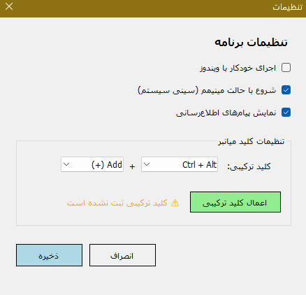

# ⌨️ Wrong Keyboard Fixer

یک ابزار سبک و کاربردی برای ویندوز که مشکل تایپ فارسی/انگلیسی با کیبوردهای اشتباه را به سرعت حل می‌کند.

---

## 📝 توضیحات

گاهی اوقات هنگام تایپ، متوجه می‌شوید که کیبورد شما در حالت اشتباه (فارسی به جای انگلیسی یا برعکس) قرار دارد و متنی که تایپ می‌کنید نامفهوم می‌شود. این برنامه با استفاده از یک **کلید ترکیبی**، متن انتخاب‌شده را تشخیص داده و به زبان صحیح تبدیل می‌کند.

---

## ✨ قابلیت‌ها

- ✅ **تبدیل خودکار متن** بین فارسی و انگلیسی
- ✅ **کلید ترکیبی قابل تنظیم** (پیش‌فرض: `Ctrl + Alt + Add(+)`)
- ✅ **اجرای خودکار با ویندوز**
- ✅ **نمایش در سینی سیستم** (کنار ساعت)
- ✅ **تنظیمات قابل ذخیره** در فایل JSON
- ✅ **جلوگیری از اجرای چند نمونه** از برنامه
- ✅ **راست‌چین بودن** رابط کاربری (مناسب فارسی‌زبانان)
- ✅ **پشتیبانی از دات‌نت 6.0 و بالاتر**

---

## 📸 تصاویر

### پنجره تنظیمات


---

## 🚀 نحوه استفاده

### نصب و اجرا

1. فایل اجرایی (`WrongKeyboardFixer.exe`) را اجرا کنید.
2. برنامه در **سینی سیستم** (کنار ساعت) قرار می‌گیرد.
3. روی آیکون برنامه راست‌کلیک کنید و **تنظیمات** را انتخاب کنید.

### نحوه کار

1. متنی که اشتباه تایپ شده را **انتخاب** کنید (هایلایت کنید).
2. کلید ترکیبی را فشار دهید (`Ctrl + Alt + Add(+)` به طور پیش‌فرض).
3. متن به طور خودکار به زبان صحیح تبدیل و جایگزین می‌شود.

### تنظیمات

| تنظیم | توضیح |
|-------|-------|
| **اجرای خودکار با ویندوز** | برنامه با شروع ویندوز اجرا می‌شود |
| **شروع با حالت مینیمایز** | برنامه در سینی سیستم شروع می‌شود |
| **نمایش پیام‌های اطلاع‌رسانی** | نمایش نوتیفیکیشن‌ها |
| **کلید ترکیبی** | انتخاب کلید میانبر دلخواه |

---

## 🔧 پیش‌نیازها

- **ویندوز 10** یا **ویندوز 11**
- **.NET 10.0 Runtime** یا بالاتر
  > [دانلود .NET 10.0 Runtime](https://dotnet.microsoft.com/en-us/download/dotnet/10.0)

---

## 📥 نصب از طریق فایل اجرایی

1. آخرین نسخه را از [Releases](https://github.com/hamedshakib/WrongKeyboardFixer/releases) دانلود کنید.
2. فایل `WrongKeyboardFixer.exe` را اجرا کنید.
3. برنامه در سینی سیستم قرار می‌گیرد.

---

## 🛠️ ساخت از سورس کد

### پیش‌نیازها برای توسعه

- [Visual Studio 2022](https://visualstudio.microsoft.com/) یا بالاتر
- [.NET 10.0 SDK](https://dotnet.microsoft.com/en-us/download/dotnet/10.0)

### مراحل ساخت

```bash
# کلون کردن مخزن
git clone https://github.com/hamedshakib/WrongKeyboardFixer.git
cd WrongKeyboardFixer

# بازیابی پکیج‌ها
dotnet restore

# ساخت پروژه
dotnet build -c Release

# اجرا
dotnet run