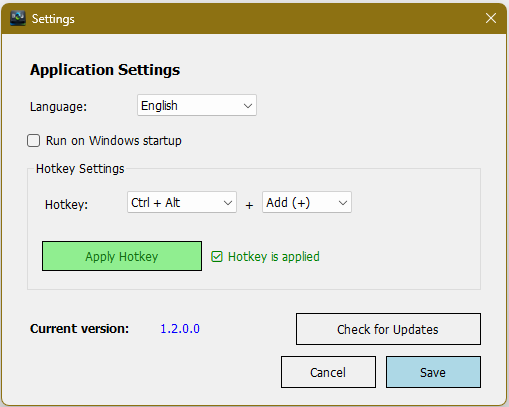
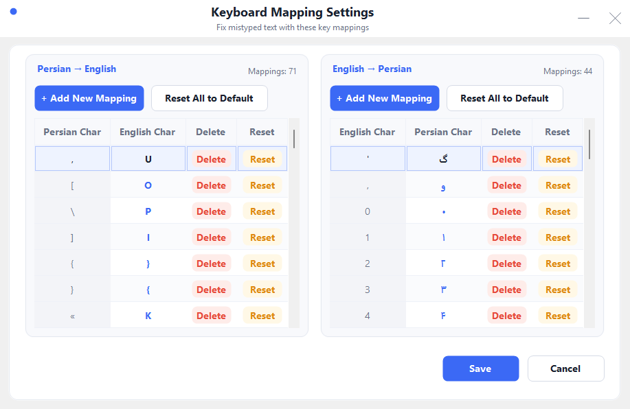

# ⌨️ Wrong Keyboard Fixer

[📖 فارسی](README.fa.md) | **English**

A lightweight Windows utility that instantly fixes text typed with the wrong keyboard layout (Persian/English).

---

## 📝 Description

Sometimes while typing, you realize your keyboard is in the wrong layout (Persian instead of English, or vice versa), and the text you typed becomes gibberish. This app detects the selected text with a **single hotkey** and converts it to the correct language.

---

## ✨ Features

- ✅ **Automatic text conversion** between Persian and English
- ✅ **Configurable hotkey** (default: `Ctrl + Alt + Add(+)`)
- ✅ **Editable keyboard mapping** — customize the Persian↔English character map
- ✅ **Runs at Windows startup** (optional)
- ✅ **System tray icon** (next to the clock)
- ✅ **Bilingual UI** — Persian (RTL) and English
- ✅ **Settings saved** to a JSON file
- ✅ **Automatic updates** — checks GitHub Releases and self-installs new versions
- ✅ **Prevents multiple instances** of the app
- ✅ **Only one instance per window** — a single Settings / Mapping window at a time
- ✅ **Built with .NET 10 and Native AOT** — no runtime required

---

## 📸 Screenshots

### Settings Window


### Keyboard Mapping Window


---

## 🚀 How to Use

### Installation & Run

1. Run the executable (`WrongKeyboardFixer.exe`).
2. The app sits in the **system tray** (next to the clock).
3. Right-click the tray icon and choose **Settings**.

### How It Works

1. **Select** the incorrectly typed text (highlight it).
2. Press the hotkey (`Ctrl + Alt + Add(+)` by default).
3. The text is automatically converted and replaced with the correct language.

---

## ⚙️ Settings

| Setting | Description |
|---------|-------------|
| **Language** | Choose the UI language: English or فارسی |
| **Run on Windows startup** | Launch the app automatically when Windows starts |
| **Hotkey** | Set a custom key combination and register it with **Apply Hotkey** |
| **Keyboard mappings** | Edit the Persian↔English character mapping |
| **Check for update** | Compare with the latest GitHub release and self-install |

### Available Hotkey Combinations

Every **modifier** below can be combined with every **key**:

| Modifiers | Keys |
|-----------|------|
| `Ctrl + Alt`, `Ctrl + Shift`, `Alt + Shift` | `Add (+)`, `Subtract (-)`, `Multiply (*)`, `F1` – `F12`, `Insert`, `Home`, `PageUp`, `PageDown`, `End`, `Delete`, `Space` |
| `Ctrl`, `Alt`, `Shift` | (same keys as above) |

> 💡 After selecting a combination, click **Apply Hotkey** to register it. A status message confirms whether the hotkey was registered successfully.

---

## 🔧 Requirements

- **Windows 10** or **Windows 11**

> 💡 Released builds are compiled with **Native AOT** and do not require the .NET Runtime to be installed.

---

## 📥 Installation from Release

1. Download the latest version from [Releases](https://github.com/hamedshakib/WrongKeyboardFixer/releases).
2. Run `WrongKeyboardFixer.exe`.
3. The app appears in the system tray.

---

## 🛠️ Build from Source

### Prerequisites for Development

- [Visual Studio 2022](https://visualstudio.microsoft.com/) or later
- [.NET 10.0 SDK](https://dotnet.microsoft.com/en-us/download/dotnet/10.0)

### Build Steps

```bash
# Clone the repository
git clone https://github.com/hamedshakib/WrongKeyboardFixer.git
cd WrongKeyboardFixer

# Restore packages
dotnet restore

# Build the project
dotnet build -c Release

# Run
dotnet run
```

### Build with Native AOT (Recommended)

To produce a standalone executable with Native AOT (no .NET Runtime needed):

```bash
# Publish with Native AOT (the runtime identifier is required for AOT)
dotnet publish -c Release -r win-x64 --self-contained true

# The standalone executable is generated at:
# bin/Release/net10.0-windows/win-x64/publish/WrongKeyboardFixer.exe
```

> ⚠️ Building with AOT requires **C++ Build Tools** or **Visual Studio with the Desktop development workload**.

---

## 📄 License

This project is licensed under the **MIT License**.

---

## 🤝 Contributing

Contributions, issues, and feature requests are welcome! Feel free to open an [issue](https://github.com/hamedshakib/WrongKeyboardFixer/issues) or submit a pull request.